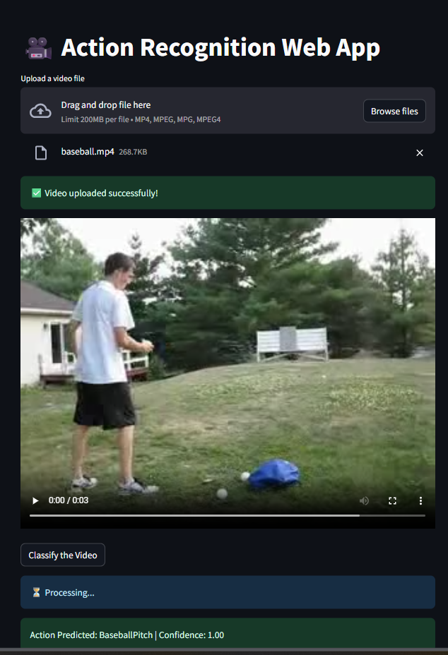
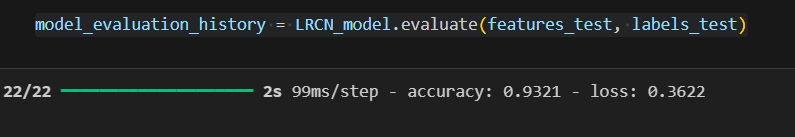

# Video__classification
# 🎥 Video Classification using CNN + LSTM

 <!-- Replace with your image or gif -->

---

## 📂 Project Title
**Video Classification using CNN + LSTM**

---

## 📊 Dataset

**Dataset Used:** [UCF50 Dataset](https://www.crcv.ucf.edu/data/UCF50.php)  
- 50 real-world action categories (first 20 used for training)  
- Sports and activity-focused videos  
- Variation in video length, resolution, and camera angle  

---

## 🎯 Objective

Build a system that can **watch a video and classify the action** (e.g., jumping, waving, dancing) using machine learning techniques.

---

## 🧠 Approaches Explored

### ❌ Baseline Approaches

- **Majority Vote of Actions**  
  → Predicts based on the most frequent frame-level label.  
  ✖ Inaccurate during transitions or mixed motions.

- **Single Frame CNN Classification**  
  → Classifies individual frames with CNN.  
  ✖ Misses temporal context.

- **Pose Detection**  
  → Focuses on human body landmarks.  
  ✖ Lacks scene understanding or object context.

---

### ✅ Final Approach: CNN + LSTM

- **CNN**: Extracts spatial features from each frame (e.g., objects, limbs, motion blur).  
- **LSTM**: Learns how these features evolve over time (e.g., movement progression).

---

## 🛠️ Working Steps

### 1. 🖼️ Frame Extraction  
- Extract 20 frames per video using OpenCV  
- Resize and normalize for consistency  

### 2. 📷 Feature Extraction (CNN)  
- Apply CNN to each frame  
- Output: Feature vector per frame  

### 3. ⏱️ Temporal Learning (LSTM)  
- Sequence of CNN vectors → LSTM  
- Learns dynamic movement patterns  

### 4. 🎯 Classification  
- Softmax output layer  
- Predicts one of the 20 actions

---

## 📈 Evaluation Metrics

## 📊 Model Accuracy

Training speed: **99 ms per step**  
Final accuracy: **93.21%**  
Final loss: **0.3622**

---

## 📸 Visual Samples

<table>
  <tr>
    <td></td>
    <td></td>
  </tr>
  </table>
- **Accuracy (Train vs Validation)**  
  → Similar trends suggest generalization  
  → Big gaps = Overfitting

- **Loss Curve**  
  → Decreasing training + validation loss = good  
  → Diverging = overfitting

---

## 🧪 Applications

- 🔍 **Real-Time Surveillance**: Suspicious activity detection  
- ⚽ **Sports Analytics**: Track player movement, assist coaches  
- 🎥 **Live Video Understanding**: Embedded in edge cameras or IoT

---

## 🔮 Future Scope

- ⏱️ Real-time performance optimization  
- 📦 Extend to all 50 UCF50 actions  
- 🚀 Broader deployment in smart cities, stadiums, and security systems

---

## 📌 Summary

This project proves that **spatial + temporal modeling** with CNNs and LSTMs allows accurate action classification in videos. The system offers immense value in **video intelligence**, **surveillance**, and **sports analytics**.

---

## 📎 Project PPT

👉 [Click to View Presentation](https://www.canva.com/design/DAGodtpCIQI/VIAhevASdOAQQRI_NNEjeA/edit?utm_content=DAGodtpCIQI&utm_campaign=designshare&utm_medium=link2&utm_source=sharebutton)  
<!-- Replace with your actual link -->

---

<!-- ## 📸 Visual Demo

```markdown
 -->
